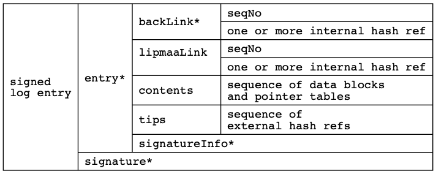

# ssb-birch


```Birch``` is a proposal for a transfer data structure for Secure
Scuttlebutt's append-only logs. It is responding to Aljoscha's
[```Bamboo```](https://github.com/aljoschameyer/bamboo) signing format and
Arj03's [modified
version](https://github.com/arj03/ssb-new-format/). See also
the discussion in SSB at %BqDQ1CK5jBh1jF2gz1YvXyrJRjswtpNb768km9XeyEk=.sha256

### Quick summary of differences (Jun 1, 2019) to Bamboo and Arj03's variant:

- only talking about logical data structure, leaving out the encoding

- rather complete spec covering all message (sub)types, using ProtoBuf

- in-chain data as well as off-chain data

- multiple (off-chain) attachments per log entry, instead of one
  payload in Bamboo

- cipherlinks can have multiple hash values, for crypto agility

- more status values than one boolean (signaling end-of-log):
  future status values could relate to log trimming, or include
  the content type, etc

- no version field

- a field for "tips" i.e., pointers to the most recent log entries
  in other feeds

---

## Introduction

New terminology: According to this ```Birch``` proposal, a __SSB log
entry__ consists of a __signed event record__ (the well-known hash chain)
optionally followed by __attachment blobs__. If present, these blobs are
listed in a field called ```attachDir``` that includes their length
and hash value, hence are indirectly included in the event's
signature. The purpose of these in-log, off-chain blobs is that they
can be removed from storage without modifying the event hash
chain. The reference for such in-log blobs is a triple
```<authorID,seqNo,attchNo>```, where a ```attachNo``` value of 0
means the bytes of the event record itself.

The following
[ProtoBuf](https://developers.google.com/protocol-buffers/docs/proto3)
record captures the event fields of a SSB log entry, to which an outer
signature has to be added. Beside the mandatory fields there are also
a few optional fields, for example the before-mentioned
```attachDir```. The full ```Birch``` ProtoBuf definition can be found
[here](ssb_birch.proto):

```text
message LogEvent { // Birch proposal for replacing SSB's current JSON dict
  // by design, we have no author (feedID) - it's part of an outer log object
  // by design, we have no sequence number - it's implicit in the hash chain
  // by design, we have no timestamp - only causality counts
  repeated HashRef              backLink    = 1; // mandatory
  SignatureInfo                 sigInfo     = 2; // mandatory
  EventStatus                   status      = 3; // optional: start/end of log
  uint64                        lipmaaLink  = 4; // optional
  repeated LogContent           contents    = 5; // optional
  repeated ExternalLogRef       tips        = 6; // optional, for tangling
  repeated AttachEntry          attachDir   = 7; // optional
}
```

The complete ```Birch``` transfer data structure is shown in the
following diagram:



```*``` denotes a mandatory field. Note the absence of a version field
which is in line with [ProtoBuf's design
philosophy](https://developers.google.com/protocol-buffers/docs/overview?csw=1#a-bit-of-history).

Derived from such a (logical) _transfer data structure_, a choice of
(binary) _signing formats_ can be specified that define how the fields
have to be encoded before signing them and how the signature bytes
have to be added for forming a __SSB transfer packet__, the same
applies to attachments. Which is the best encoding? We do not know. In
the past, JSON was used for encoding the event as well as its
signature. In the future, ProtoBuf, CBOR, or other wire formats
_and/or combinations_ should be considered: ```Birch``` does not cover
this yet. Note also that this ```Birch``` document does not look into
__database formats__ which would include additional fields like e.g.,
the omitted sequence number and author's id.


---

## Comments on the ```Birch``` Transfer Data Structure

- using ProtoBuf forces us to be explicit when we say "hashref", for
  example.

- side benefit: ProtoBuf is a candidate for binary encoding, with many
  language bindings

- no author field: the _log_ itself is bound to an author id, no need
  to put this information into each log event

- no sequence number field: redundant in a (hash-) linked list

- no timestamp field: too easy to lie about such a field (unless it
  would be signed GPS time), forces apps to work with safe causality

- ```backLink``` is an internal (to this log) reference, wherefore no
  author ID is needed, just one or more hash reference that point to
  the previous log event. Using a _set_ instead of a single hash
  reference permits to introduce stronger hash algorithms over time
  (writing down several hash values in parallel), and gradually phase
  out old hashing algorithms.

- ```signatureInfo``` selectes the algorithm used to sign this event
  and must be part of the signed bytes. Note that depending on the
  signature algorithm used, ```signatureInfo``` will contain key
  locator data.

- optional ```EventStatus```: flags the start or end of a log

- optional Lipmaa link: internal reference (as above), see the
  [```Bamboo```](https://github.com/aljoschameyer/bamboo) proposal for
  more details

- ```contents```: zero or more content pieces, permitting a) to
  include data in the log event itself, b) to refer to a sequence of
  off-chain data, c) any combination thereof. All event-included as
  well as referenced data is concatenated when forming the content's
  value of this event. An empty content is valid (the event could be
  about recording tips into other logs, for example).

- An interesting discussion/decision is whether off-chain data may
  refer to _other_ logs, or MUST be in the same log as the event itself
  i.e., in-log attachments. I clearly prefer the latter, because it's
  about the content _of that event_ that we want to process, and it
  would be cumbersome if we have to postpone this processing until we
  got that other log's data. Note that _inside_ the content field
  there is full freedom to refer to external blobs or log entries.

- Not all attachments need to be part of the content field. It is
  possible to attach multiple pictures, and reference them from
  within the content, instead of using the classic SSB blobs for
  this.

- ```tips```: zero or more external references which MUST point to
  other logs and SHOULD point to the corresponding freshest entries at
  the time of signing this log's event.

- ```attachDir```: zero of more length/hash reference pairs which refer to
  the blobs directly following the signed event record. (in-log,
  off-chain data)

Note that _external log references_ (as e.g., used in the tips field)
include an author ID, a sequence number, as well as a set of hash
references.

---

## Open ends (this is work in progress)

- encoding of this transfer data structure: is backwards compatibility
  a must, and feasible?

- selecting binary encoding (inner, outer): based on speed, breadth of
  language support, or ?

- should the content's type have a meta-data entry in the event record,
  or be part of the content's encoding? Case in favor of the former:
  multiple encryption formats (crypto agility for SSB's box string).
  The current ProtoBuf spec (and diagram above) does not have
  such a content type field.

- size restrictions for attachents - what is a good limit? Why not
  have 64MB attachments? Their size if indicated in the ```attachDir```
  field, so a client could opt out from downloading it.

---