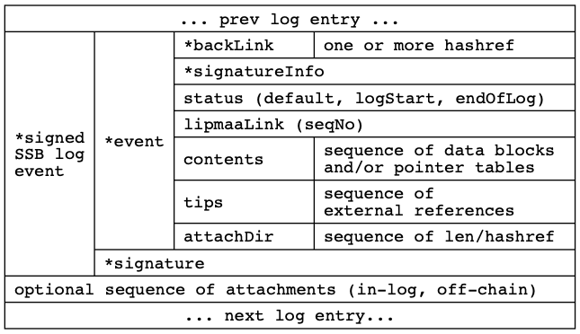

# ssb-birch


```Birch``` is a proposal for a new Secure Scuttlebutt wire format,
responding to Aljoscha's [```Bamboo```](https://github.com/aljoschameyer/bamboo)
format and Arj03's [slightly modified version](https://github.com/arj03/ssb-new-format/).


## A minimal wire format




## Using ProtoBuf to describe the wire format

explain why ...